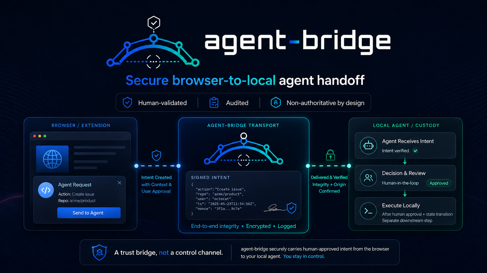

# agent-bridge



**Secure browser-to-local agent handoff.**

`agent-bridge` is a human-validated transport layer between browser-based AI workspaces and local agentic environments. It lets a browser extension submit signed intent to a local bridge, where pairing, nonce, timestamp, audit, custody, and decision-review boundaries preserve the core rule:

> **A trust bridge, not a control channel.**

The browser may express intent. The bridge may verify and audit intent. The Librarian remains the authority layer.

---

## What agent-bridge does

`agent-bridge` carries structured work intent from a browser/extension surface to a local agent workflow without granting the browser, extension, bridge, or model direct authority over execution.

The current architecture supports:

- Human-in-the-loop queue lifecycle
- Local bridge transport
- Pairing-bound extension status reflection
- Signed decision-intent submission
- Replay protection using nonce/timestamp validation
- Append-only audit trail for decision intents
- Read-only custody/status reflection
- Cross-project SEC-1 security inheritance classification
- Planned AB-8 decision review / decision record viewer

---

## Governing principle

```text
AB-7 emits intent.
SEC-1 hardens the path.
AB-8 displays the record.
```

The implementation boundary is explicit:

```text
agent-bridge may transport and audit intent.
agent-bridge may not approve, execute, or become authority.
```

---

## Trust chain

```text
Browser / Extension
  → Signed intent envelope
    → agent-bridge pairing + nonce + timestamp verification
      → append-only audit trail
        → Librarian custody / decision record
          → read-only extension-visible status
```

Complete verified chain:

| Sprint | Status | Role |
|---|---:|---|
| AB-1 | Complete | Bridge lifecycle verification |
| AB-2 | Complete | Integration boundary specification |
| AB-3 | Complete | Safe receipt generation, producer-side |
| AB-4 | Complete | Safe receipt validation, receiver-side |
| AB-5 | Complete | Controlled custody handoff, Librarian-side |
| AB-5b | Complete | Extension identity boundary |
| AB-6 | Complete | Read-only extension status reflection |
| AB-7 | Complete | Signed non-authoritative decision intent channel |
| SEC-1 | Complete | Security, privacy, intrusion, integrity baseline |
| SEC-1A | Complete | Cross-project inheritance enforcement |
| AB-8 | Planned | Read-only decision review / record viewer |

---

## Security posture

agent-bridge inherits SEC-1 controls as a connected project in the Agile in a Box suite.

| Component | Inheritance classes | Authority status |
|---|---|---|
| Bridge server | A / B / C / E | Non-authoritative transport |
| Browser extension | A / B / C / E | Intent emitter only |

The critical rule:

```text
Theme token, not permission token.
Intent channel, not approval channel.
Bridge transport, not authority.
Extension affordance, not decision source.
Librarian validation, then decision record.
```

---

## Current baseline

| Repository | Commit | Status |
|---|---:|---|
| TheLibrarian | `b61466a` | SEC-1A complete; core + LINK inheritance declared |
| agent-bridge | `cf60830` | AB-8 sprint doc committed; Class A/B/E declared |
| QA-PilotV2 | `8a9e9f5` | SEC-1 inheritance declared |

AB-8 implementation line:

```text
AB-8 may inspect decisions.
AB-8 may not make decisions.
```

---

## Features

### Local-first bridge transport

The bridge runs locally and receives structured work intent from a paired browser extension.

### Human validation by design

The system is built around human decision custody. The bridge does not silently approve or execute work.

### Signed decision intent

AB-7 introduced signed decision-intent envelopes with pairing, nonce, timestamp, and replay protection.

### Append-only audit trail

Decision intents are recorded in an append-only JSON-lines audit trail.

### Read-only status reflection

AB-6 introduced paired extension status reflection without mutation paths or authority fields.

### Cross-project security inheritance

SEC-1A ensures connected projects inherit security controls before implementation begins.

---

## Planned next layer: AB-8

AB-8 adds a read-only decision review surface.

It should expose:

```text
extension intent
→ bridge verification/audit
→ custody link
→ Librarian decision record
→ integrity status
→ extension-visible status
```

It must not expose or create:

```text
approval action
queue mutation
execution trigger
identity leakage
authority transfer
CSS/display-state permission
```

---

## Project structure

```text
agent-bridge/
  server/       TypeScript local bridge server and MCP integration
  extension/    Browser extension UI surface
  docs/         Architecture, governance, security, and sprint documents
  assets/       Brand and release assets
```

---

## Documentation

Start here:

- [`docs/architecture/AB-TRUST-CHAIN.md`](docs/architecture/AB-TRUST-CHAIN.md)
- [`docs/security/SECURITY-AUTHORITY-MODEL.md`](docs/security/SECURITY-AUTHORITY-MODEL.md)
- [`docs/implementation/AB-8-IMPLEMENTATION-HANDOFF.md`](docs/implementation/AB-8-IMPLEMENTATION-HANDOFF.md)
- [`docs/release/RELEASE-NOTES.md`](docs/release/RELEASE-NOTES.md)
- [`docs/release/GITHUB-REFRESH-INSTRUCTIONS.md`](docs/release/GITHUB-REFRESH-INSTRUCTIONS.md)
- [`docs/release/BRAND-ASSETS.md`](docs/release/BRAND-ASSETS.md)

---

## License

MIT
